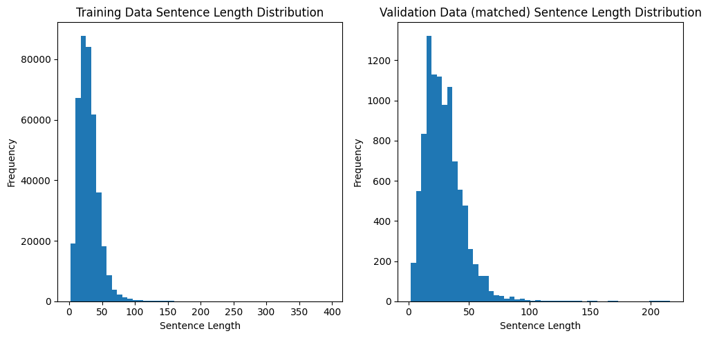
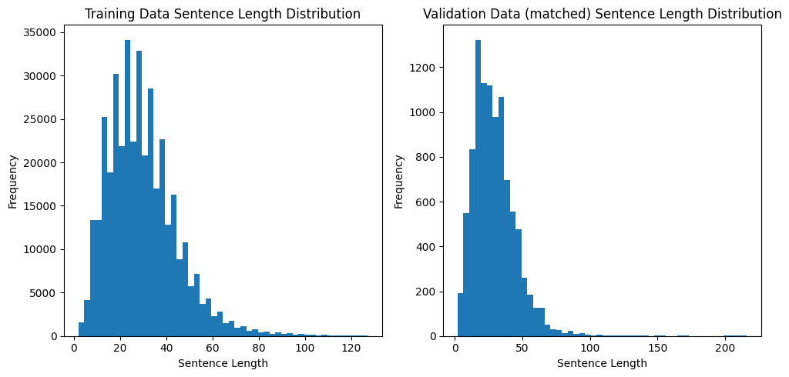

3주차까지 AI의 이론을 배우고, 직접 모델을 구현하는 과정을 거쳤고,  


## [기본] HuggingFace

4주차에는 HuggingFace 플랫폼을 사용해서 모델을 학습하는 과정을 배웠다.  

이 방법은 현업에서 많은 ML Engineer들이 실제로 사용하고 있는 방법이라고 하는데, 확실히 직접 Transformer 모델을 구현하는 것 보다 훨씬 코드가 간결해졌고,
출력 결과도 깔끔하고, wandb를 바로 사용할 수 있다는 것도 편리했다.

확실히 바닐라JS를 익히고, React를 사용하면 더 이해가 쉬운 것처럼
AI도 PyTorch로 직접 Transformer 모델을 구현해보고, 이후에 HuggingFace를 사용하니 더 이해가 쉬웠다.

### 과제

MNLI 데이터셋을 사용해서, 두 문장 간의 논리적 관계를 판단하는 모델을 만드는 과제였다.  

1. EDA 및 데이터 전처리

학습 데이터:
- 최대 길이: 396
- 평균 길이: 29.78

검증 데이터 (matched):
- 최대 길이: 216
- 평균 길이: 29.18




> 학습 데이터 길이가 전반적으로 100 이하인 것을 확인할 수 있어서, 이보다 긴 데이터는 제외하고 학습시키는 방향으로 진행하기로 했다.

학습 데이터:
- 최대 길이: 127
- 평균 길이: 29.56

검증 데이터 (matched):
- 최대 길이: 216
- 평균 길이: 29.18



학습데이터는 128 미만의 데이터만 필터링하고, 검증 데이터는 그대로 사용.

[HuggingFace 과제 전체 코드](https://github.com/teacherSsamko/DL-study/blob/main/%08w4_1.ipynb)


2. 모델 학습

**BERT 모델을 사용한 학습 결과**

> 학습 시간이 9시간 가까이 걸렸다.

| Epoch | Training Loss | Validation Loss | Accuracy |
|-------|--------------|-----------------|-----------|
| 1 | 0.553400 | 0.462073 | 0.818635 |
| 2 | 0.376100 | 0.441790 | 0.831019 |
| 3 | 0.265600 | 0.484720 | 0.831618 |
| 4 | 0.186600 | 0.561473 | 0.828825 |
| 5 | 0.133300 | 0.650474 | 0.826249 |
| 6 | 0.098100 | 0.735423 | 0.827205 |
| 7 | 0.074500 | 0.853703 | 0.824680 |
| 8 | 0.057800 | 0.892868 | 0.826950 |
| 9 | 0.045900 | 1.023744 | 0.826950 |
| 10 | 0.037200 | 1.082273 | 0.827142 |

3 epoch만에 최대 학습 정확도 83%를 달성하고, 이후에 점차 감소하는 것을 확인할 수 있었다.

**distilBERT 모델을 사용한 학습**

비교를 위해 distilBERT 모델을 사용했고, distilBERT의 파라미터는 학습하지 않도록 설정했다. 이번에도 과적합이 발생할 것으로 예상되어 epoch을 5로 제한했다.

```python
for param in model.distilbert.parameters():
  param.requires_grad = False
```

| Epoch | Training Loss | Validation Loss | Accuracy |
|-------|--------------|-----------------|-----------|
| 1 | 1.088900 | 1.078951 | 0.408031 |
| 2 | 1.078700 | 1.071682 | 0.417248 |
| 3 | 1.075000 | 1.068300 | 0.422409 |
| 4 | 1.073000 | 1.066694 | 0.424908 |
| 5 | 1.072000 | 1.066206 | 0.426490 |

한 시간만에 학습이 됐지만, 과적합이 발생하지 않았고, 정확도는 42%로 매우 낮게 나왔다. distilBERT 자체의 한계라고 보기엔 차이가 너무 심하다고 생각되서, distilBERT의 파라미터도 학습을 시켜야겠다고 판단했다.

**distilBERT의 파라미터도 학습한 결과**

| Epoch | Training Loss | Validation Loss | Accuracy |
|-------|--------------|-----------------|-----------|
| 1 | 0.886300 | 0.806939 | 0.640874 |
| 2 | 0.768100 | 0.768995 | 0.666916 |
| 3 | 0.699400 | 0.752836 | 0.675359 |
| 4 | 0.642700 | 0.776968 | 0.674662 |
| 5 | 0.600300 | 0.785430 | 0.675512 |

distilBERT의 파라미터도 학습에 포함시켰더니, 정확도가 67%까지 올라갔다. 여전히 BERT 모델의 83%에는 미치지 못하지만, 학습 시간은 2시간 정도로 크게 단축되었다.

overfitting이 발생하지 않았기에, epoch을 늘리면 더 높은 정확도를 달성할 수 있을 것으로 예상되었지만, 과제 통과 기준인 50%를 달성했기도 하고, colab credit 문제로 학습을 더이상 진행시키지는 않았다.


## [심화] OpenAI API

OpenAI API를 사용해서 LLM을 사용하는 과제도 진행했는데, 이미 OpenAI API를 이용해서 챗봇도 만들었고, 이미지 생성도 하고 있기 때문에, API사용 자체는 익숙했고, Prompt작성도 익숙했지만,

이번에는 LLM의 성능을 최대한 높일 수 있는 Prompting 전략을 좀 더 익히고, 이를 통해서 과제의 통과 기준을 채우는 것이 목표였다.

### 과제

이 과제는 GPT-4o 모델을 사용해서 2023 수능 국어문제를 풀어보는 과제였다.


데이터는 [KICE Slayer AI korean](https://github.com/NomaDamas/KICE_slayer_AI_Korean) 에서 제공하는 데이터를 사용했다.


1. EDA

데이터는 아래와 같은 형태로 이루어져있었다.

```json
{
    "id": "2023_11_KICE_1-3",
    "paragraph": "사람들이 지속적으로 책을 읽는 이유 중 하나는 즐거움이다. 독서의 즐거움에는 여러 가지가 있겠지만 그 중심에는 ‘소통의 즐거움’이 있다.독자는 독서를 통해 책과 소통하는 즐거움을 경험한다. 독서는필자와 간접적으로 대화하는 소통 행위이다. 독자는 자신이 속한사회나 시대의 영향 아래 필자가 속해 있거나 드러내고자 하는 사회나 시대를 경험한다. 직접 경험하지 못했던 다양한 삶을 필자를 매개로 만나고 이해하면서 독자는 더 넓은 시야로 세계를바라볼 수 있다. 이때 같은 책을 읽은 독자라도 독자의 배경지식이나 관점 등의 독자 요인, 읽기 환경이나 과제 등의 상황 요인이 다르므로, 필자가 보여 주는 세계를 그대로 수용하지 않고 저마다 소통 과정에서 다른 의미를 구성할 수 있다.[A] (이러한 소통은 독자가 책의 내용에 대해 질문하고 답을 찾아내는 과정에서 가능해진다. 독자는 책에서 답을 찾는 질문, 독자 자신에게서 답을 찾는 질문 등을 제기할 수 있다. 전자의 경우 책에 명시된 내용에서 답을 발견할 수 있고, 책의 내용들을 관계 지으며 답에 해당하는 내용을 스스로 구성할 수도 있다. 또한 후자의 경우 책에는 없는 독자의 경험에서 답을 찾을 수 있다. 이런 질문들을 풍부히 생성하고 주체적으로 답을 찾을 때 소통의 즐거움은 더 커진다.)한편 독자는 ㉠ (다른 독자와 소통하는 즐거움을 경험할 수도 있다.) 책과의 소통을 통해 개인적으로 형성한 의미를 독서 모임이나 독서 동아리 등에서 다른 독자들과 나누는 일이 이에 해당한다. 비슷한 해석에 서로 공감하며 기존 인식을 강화하거나 관점의 차이를 확인하고 기존 인식을 조정하는 과정에서, 독자는자신의 인식을 심화 확장할 수 있다. 최근 소통 공간이 온라인으로 확대되면서 독서를 통해 다른 독자들과 소통하며 즐거움을누리는 양상이 더 다양해지고 있다. 자신의 독서 경험을 담은 글이나 동영상을 생산 공유함으로써, 책을 읽지 않은 타인이 책과 소통하도록 돕는 것도 책을 통한 소통의 즐거움을 나누는 일이다.",
    "type": 0,
    "problems": [
      {
        "question": "윗글의 내용과 일치하지 않는 것은?",
        "choices": [
          "같은 책을 읽은 독자라도 서로 다른 의미를 구성할 수 있다.",
          "다른 독자와의 소통은 독자가 인식의 폭을 확장하도록 돕는다",
          "독자는 직접 경험해 보지 못했던 다양한 삶을 책의 필자를 매개로 접할 수 있다.",
          "독자의 배경지식, 관점, 읽기 환경, 과제는 독자의 의미 구성에 영향을 주는 독자 요인이다.",
          "독자는 책을 읽을 때 자신이 속한 사회나 시대의 영향을 받으며 필자와 간접적으로 대화한다"
        ],
        "answer": 4,
        "score": 2
      },
      {
        "question": "다음은 학생이 독서 후 작성한 글의 일부이다. [A]를 바탕으로 ⓐ～ⓔ를 이해한 내용으로 가장 적절한 것은?",
        "question_plus": "ⓐ('음악 시간에 들었던 베토벤의 교향곡 <합창>이 위대한 작품인 이유는 무엇일까?'하는 생각)에, 베토벤에 대한 책을 빌렸다. 책에서는 기약만으로 구성됐던 교향곡에 성악을 결합헤 개성을 드러냈다는 점에서 ⓑ(이 곡이 낭만주의 음악의 특징을 보여 준다고 했다.) <합창>을 해설한 부분에 이어, 베토벤의 생애에 관한 뒷부분도 읽었는데, ⓒ(이 내용들을 종합해, 절망적 상황에서도 열정적으로 자신이 좋아하는 일을 했기에 교향곡 구성의 새로움을 보여 준 명작이 탄생했음을 알게 됐다.) 이후 ⓓ(내가 진정으로 좋아하는 일이 무엇인지 나에게 묻게 되었다.) ⓔ(글 쓰는 일에서 가장 큰 행복을 느꼈던 나를 발견)할 수 있었고, 나도 어떤 상황에서든 좋아하는 일을 계속해야겠다고 생각했다.",
        "choices": [
          "ⓐ와 ⓑ에는 모두 ‘독자 자신에게서 답을 찾는 질문’이 나타난다.",
          "ⓒ와 ⓓ에는 모두 ‘책에 명시된 내용’에서 질문의 답을 찾아내는 모습이 나타난다.",
          "ⓐ에는 ‘책에서 답을 찾는 질문’이, ⓔ에는 그에 대한 답을 ‘독자의 경험’에서 찾아내는 모습이 나타난다.",
          "ⓑ에는 ‘책에서 답을 찾는 질문’이, ⓒ에는 그에 대한 답을 ‘책의 내용들을 관계 지으며’ 찾아내는 모습이 나타난다.",
          "ⓓ에는 ‘독자 자신에게서 답을 찾는 질문’이, ⓔ에는 그에 대한 답을 ‘독자의 경험’에서 찾아내는 모습이 나타난다."
        ],
        "answer": 5,
        "score": 3
      },
      {
        "question" : "윗글을 읽고 ㉠에 대해 보인 반응으로 적절하지 않은 것은?",
        "choices" : [
          "스스로 독서 계획을 세우고 자신에게 필요한 책을 찾아 개인적으로 읽는 과정에서 경험할 수 있겠군.",
          "독서 모임에서 서로 다른 관점을 확인하고 자신의 관점을 조정하는 과정에서 경험할 수 있겠군.",
          "개인적으로 형성한 의미를, 독서 동아리를 통해 심화하는 과정에서 경험할 수 있겠군.",
          "자신의 독서 경험을 담은 콘텐츠를 생산하고 공유하는 과정에서 경험할 수 있겠군.",
          "오프라인뿐 아니라 온라인 공간에서 해석을 나누는 과정에서도 경험할 수 있겠군."
        ],
        "answer": 1,
        "score": 2
      }
    ]
  }
```

2. prediction, parse_answer 함수 작성

문제를 풀고, 정답을 답하는 prediction 함수와 응답에서 정답을 parsing하는 parse_answer 함수를 작성하는 것이 핵심이었다.

prompting에는 COT(Chain of Thought)를 사용했는데, 질문 전체를 한글로 작성하고, 마지막 COT만 영어(Let's think step by step)로 제공했다. 이는 prompting 전략 중에서 COT를 영어로 작성하는 것이 우리말로 작성하는 것보다 성능이 좋게 나왔다는 것을 확인했기 때문이다. [벤치마크 결과](https://github.com/NomaDamas/KICE_slayer_AI_Korean/tree/master#vii-%EB%B2%A4%EC%B9%98%EB%A7%88%ED%81%AC-%EA%B2%B0%EA%B3%BC)

답변의 형식을 지정해주는 방식의 성능은 조금 낮게 나왔는데, parsing을 하기 위해 답변의 형식을 지정해주면서 성능을 유지하기 위한 테스트를 많이 했으나, 결국 성능이 떨어지는 것을 확인했다. 그래서 일반적은 응답을 그대로 사용하는 방식으로 진행했다.

내가 최종적으로 작성한 프롬프트에 대한 답변으로 대부분 응답의 마지막에 정답을 말하는 것이 확인되어서 parse_answer 함수에서는 마지막 문장에 있는 숫자를 정답으로 추출하는 방식으로 사용하였다.  

그리고, 오답인 문제에 한해서만 API응답 전문을 반환하도록 했는데, parsing에 실패한 경우는 전체 45문제 중에 단 한 건만 발생하였다. 

`score: 85`

최종적으로 85점을 기록했고, 이는 KICE Slayer AI korean 벤치마크 결과의 최고점과 같았다. 해당 벤치마크에서 최고점을 기록한 것은 역시 COT를 영어로 작성한 prompt였는데, COT자체가 정말 영향을 많이 끼친다는 것을 직접 확인할 수 있었다.

[OpenAI API 과제 전체 코드](https://github.com/teacherSsamko/DL-study/blob/main/w4_2.ipynb)